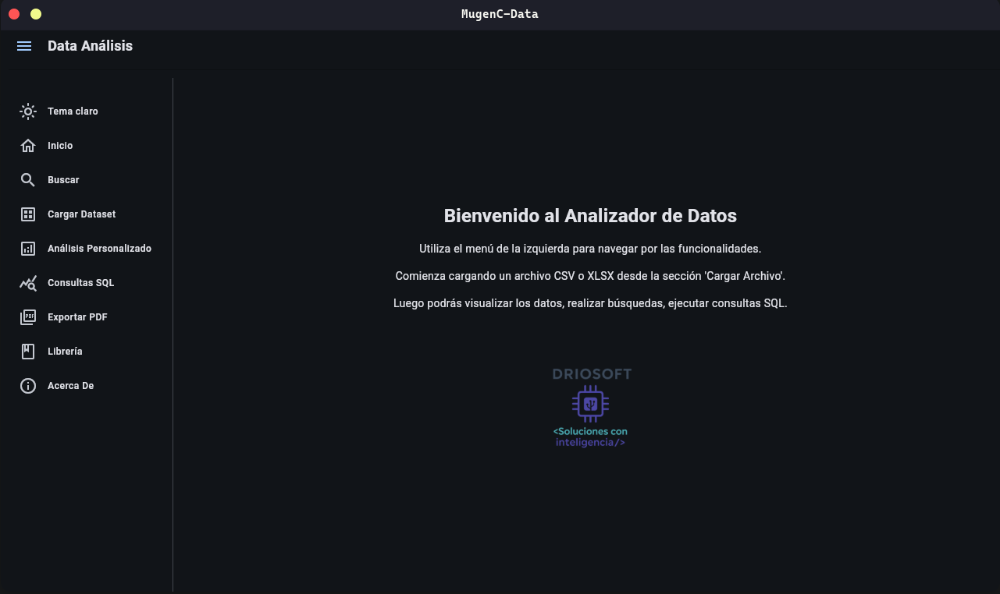
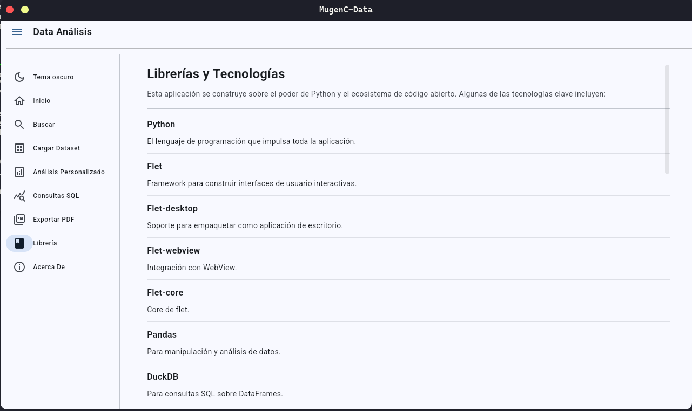
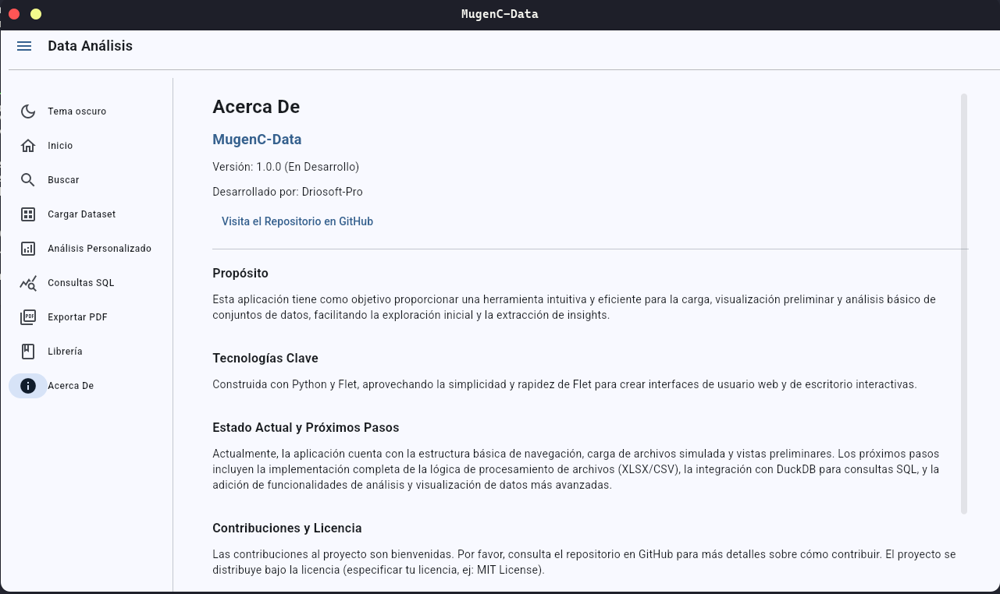

# Analizador de Datos con Python y Flet








Este proyecto es una aplicación de escritorio y web construida con [Python](https://www.python.org/) y [Flet](https://flet.dev/) para facilitar el análisis básico de datasets en formato CSV. Permite cargar archivos, visualizar datos, realizar consultas personalizadas y generar gráficos estadísticos de manera intuitiva.

---

## 📌 Objetivos de la Aplicación

- **Carga de Archivos:** Permitir al usuario cargar archivos CSV desde el sistema.
- **Análisis Básico:**
  - Mostrar el número total de registros (filas) y columnas.
  - Listar los encabezados (nombres de columnas).
- **Consultas Personalizadas:**
  - Ingresar comandos para consultar los datos.
  - Mostrar resultados tabulares.
- **Visualización:**
  - Generar gráficos básicos a partir de los datos o consultas.
- **Plataformas:**
  - Funciona como aplicación **de escritorio** y **web**.

---

## 📚 Requisitos

- Python 3.10 o superior
- Webcam
- Sistema operativo con soporte para:
  - OpenCV
  - MediaPipe
  - PyAutoGUI
  - Xlib (en Linux para control de mouse)

> **Librerías necesarias:**
> - flet
> - pandas
> - numpy
> - polars
> - matplotlib
> - seaborn
> - duckdb
> - pytest
> - black
> - flake8
> - isort
> - ReportLab 
> - openpyxl
> - xlrd


## ⚙️ Características de Librerías Necesarias

### Interfaz de Usuario
- [`flet`](https://pypi.org/project/flet/): UI principal para web y escritorio.
- `flet-desktop` o empaquetadores como `PyInstaller` (para versiones ejecutables).

### Análisis de Datos
- [`pandas`](https://pandas.pydata.org/): Manipulación y análisis de datos.
- [`numpy`](https://numpy.org/): Operaciones numéricas (dependencia de pandas).
- [`polars`](https://www.pola.rs/): Alternativa moderna y rápida a pandas (opcional).

### Visualización
- [`matplotlib`](https://matplotlib.org/): Gráficos base en Python.
- [`seaborn`](https://seaborn.pydata.org/): Gráficos estadísticos avanzados.

### Consultas SQL
- [`duckdb`](https://duckdb.org/): Ejecuta consultas SQL sobre DataFrames.

### Calidad de Código y Testing
- [`pytest`](https://docs.pytest.org/): Framework de testing.
- [`black`](https://github.com/psf/black): Formateador automático.
- [`flake8`](https://flake8.pycqa.org/): Linter de estilo.
- [`isort`](https://pycqa.github.io/isort/): Ordena imports automáticamente.
- [`tabulate`](https://pypi.org/project/tabulate/): Impresión de tablas en consola.tabulate

### Utilidades
- [`ReportLab`](https://www.reportlab.com/): Generación de PDFs.
- [`openpyxl`](https://openpyxl.readthedocs.io/en/stable/): Leer y escribir archivos Excel.
- [`xlrd`](https://pypi.org/project/xlrd/): Leer y escribir archivos Excel.
- [`reportlab`](https://pypi.org/project/reportlab/): Generación de PDFs.
- [`time`](https://docs.python.org/3/library/time.html): Manipulación de fechas y horas.

---

## 🗂️ Estructura de Directorios
```bash
data_analysis/
│
├── app/
│   ├── __init__.py
│   ├── main.py                         # Punto de entrada y layout principal
│   ├── constants.py                    # Constantes globales
│   ├── views/                          # Módulo de vistas
│   │   ├── __init__.py                 # (Opcional) Organización de vistas
│   │   ├── home_view.py                # Vista de Inicio
│   │   ├── bar_navigation.py           # Navegación lateral
│   │   ├── search_view.py              # Vista de Buscar
│   │   ├── export_pdf_view.py          # Vista para exportar PDF
│   │   ├── file_upload_view.py         # Vista para cargar archivos
│   │   ├── file_upload_confg.py        # Funciones de carga de archivos
│   │   ├── data_display_view.py        # Vista para visualizar datos
│   │   ├── library_view.py             # Vista para la biblioteca cargadas
│   │   ├── about_view.py               # Vista de Acerca de
│   │   └── query_view.py               # Vista para realizar consultas
│   ├── controls/                       # Módulo de controles personalizados
│   │   ├── __init__.py                 # (Opcional) Organización de controles
│   │   ├── data_table_custom.py        # Control personalizado de tabla
│   │   └── plot_container.py           # Control personalizado de gráficos
│   └── assets/                         # Módulo de recursos
│       └── icon.png                    # Icono de la app
│
├── core/
│   ├── __init__.py                     # Módulo principal
│   ├── data_loader.py                  # Carga de datos
│   ├── data_analyzer.py                # Análisis de datos
│   ├── query_engine.py                 # Motor de consulta SQL
│   ├── file_processor.py               # Procesamiento de archivos
│   ├── app_state.py                    # Procesamiento de archivos
│   └── plot_generator.py               # Generación de gráficos
│
├── tests/                              # Pruebas unitarias 
│   ├── __init__.py                     # Módulo principal
│   ├── core/                           # Módulo de pruebas
│   │   ├── __init__.py                 # (Opcional) Organización de pruebas
│   │   ├── test_data_loader.py         # Pruebas para data_loader.py
│   │   └── test_query_engine.py        # Pruebas para query_engine.py
│   └── app/                            # Módulo de pruebas
│       ├── __init__.py                 # (Opcional) Organización de pruebas
│       └── test_file_upload_view.py    # Pruebas para file_upload_view.py
│
├── data/                               # Datasets de ejemplo o cargados (añadir a .gitignore)
├── .gitignore                          # Ignora archivos y carpetas para Git
├── pyproject.toml                      # Configuración y dependencias (Poetry, PDM)
├── setup.cfg                           # Configuración y dependencias (setuptools)
├── README.md                           # Este documento
└── requirements.txt                    # Alternativa simple para instalar dependencias
```

## 🚀 Instalación
```bash
# Clona el repositorio:
git clone https://github.com/driosoft-pro/analizador_datos_flet.git
cd analizador_datos_flet

# Instala las dependencias:
pip install -r requirements.txt

# Ejecuta la app:
python -m app.main

# Pruebas unitarias:
pytest                  # Ejecutar todas las pruebas
pytest -v --tb=short    # Ejecutar pruebas con detalles adicionales
```

---

# 🗒️ Notas:
# - Puedes usar `pip freeze > requirements.txt` luego de probar todo.
# - Si usas `pyproject.toml`, muchas versiones se pueden dejar sin fijar para evitar bloqueos de compatibilidad.

---

## 📜 Licencia

Este proyecto está licenciado bajo la **MIT License**.

---

## ✍️ Autor

✍️ **Desarrollado por:** **Deyton Riascos Ortiz**  
🗓️ **Fecha:** 2025  

---